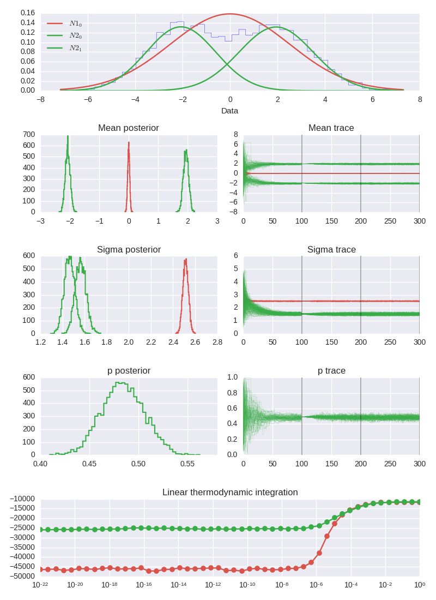

# Bayes Bimodal Test

This is a simple implementation of a Bayesian model comparison for bimodality.
In typical usage, we have a 1D set of data points `data`, then the test 
fits a unimodal and bimodal
Gaussian to the data, computes the unnormalised evidence for both and prints
the so-called Bayes factor [Bayes Factor](https://en.wikipedia.org/wiki/Bayes_factor)
between the two models.

## Example

This is the code contained in the `test.py` example

``` python
import BayesBimodalTest as BBT
import numpy as np

# Generate fake data
N = 5000
dataA = np.random.normal(2, 1.5, N/2)
dataB = np.random.normal(-2, 1.5, N/2)
data = np.concatenate([dataA, dataB])

# Create a test object
test = BBT.BayesBimodalTest(data, nburn0=100, nburn=100, nprod=100, ntemps=50)

# Create the diagnostic plot
test.diagnostic_plot()

# Print the Bayes factor
test.BayesFactor()
```

Running this code will output a log10 Bayes factor, in this case of `68.1 +/- 5.0` giving
strong evidence in support of the Bimodal model. To be specific, this mean that
`P(bimodal| data) / P(unimodal| data)) = 10^{68.51}`. The error is an estimate
of the systematic error produced by the numerical integration of the temperature,
this can be reduced by increasing the number of temperatures.

It will also produce a
diagnostic plot which we show below. In the top panel is the
original raw data along with the fitted underlying distributions, then 6 panels
gives the posterior and traces of the mean, std. dev., and the weight (only of
the bimodal mixture model). Finally there are two plots of the thermodynamic
integration used to calculate the evidence.



## Details

* We use the [parallel tempered emcee sampler (PTSampler)](http://dan.iel.fm/emcee/current/user/pt/)  to perform MCMC parameter estimation.

* The PTSampler conveniently has in-built thermodynamic integration to estimate the
  the evidence and error of that evidence. For more information see the implementation
  notes of the PTSampler

* The methodology for the MCMC chains is a three step process as follows.

  1. Define uniform priors for the mean by `[min(data), max(data)]`, for the
    std. dev. by `[0, 2std(data)]`, and for the weight of the bimodal mixture
     model as `[0, 1]`.

  2. Initialise
  the MCMC chains picking randomly from these priors, run for `nburn0` steps.

  3. Select the chain with the largest probability and reinitialise all the chains
  in a small spread about this point. Run the chains for `nburn` and discard,
  run the chains for `nprod` and use to estimate the posterior and evidence.

  This `nburn0` run here removes the chains which get stuck. It is not always required,
  and if the posteriors are multimodal can in fact distort the inference, so the
  chains should always be checked. This step can be removed by setting `nburn0=0`.

* The choice of priors *always* favours the unimodal model with a Occam factor
  of `-(log10(max(data) - min(data)) + log10(2 std(data)))`. This is printed
  out along with Bayes factor. If the evidence is smaller than this value, then
  one should examine the assumptions made on the prior. For the example above
  the Occam factor is `1.86`, which is much smaller than the evidence and hence
  the conclusion is robust to changes in the prior.


